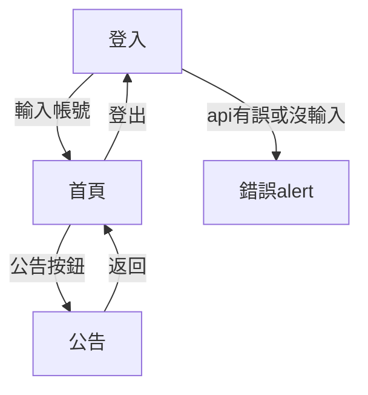

# sample code

## 架構圖

## 技術選型與理由

> - MVI架構
>   - 分為四個檔案 view viewModel repository result
>     - view: UI
>     - viewModel: intent & state
>     - repository: 負責call api
>     - result: api response
> - 理由
>   - state 主要是由 intent 我有試著把它們拆開來放在不同class但有遇到許多問題 像是 明明已經更改了屬性 但view卻沒有動作之類的 並且拆開也會增加資料傳遞的麻煩
